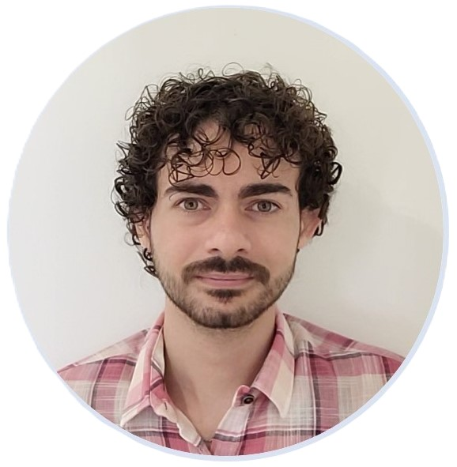
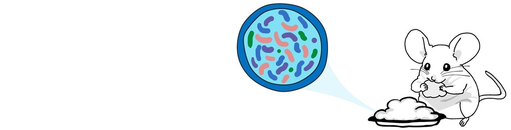

*A winter sunset in Trieste, 2023*

# Vitor M. Marquioni

[Home](README.md)  |  [Projects](projects.md)  |  [Teaching](teaching.md)  |  [Publications](publications.md)  |  [Blog](blog.md)

---

<table style="border-collapse: collapse; width: 100%;">
<tr style="border: none;">
<td style="border: none; padding: 0; vertical-align: top; width: 275px;">

</td>
<td style="border: none; padding: 0; vertical-align: center;">

<h2> About Me </h2>

I am a physicist by training, with background in statistical mechanics, dynamical systems and stochastic processes. I am currently a Centuri postdoc in Dr.       Florence Bansept’s lab, in the Laboratoire de Chimie     Bacterienne (LCB), Marseille, France. In my research, I apply mathematical modelling techniques to understand biological phenomena.  

<ul>
  <li>My Erdos number is 5.</li>
  <li>You can reach me out by email, <i>vitor.MARQUIONI-MONTEIRO@univ-amu.fr</i>.</li>
  <li>My <a href="https://scholar.google.com/citations?user=FyyhlpYAAAAJ&hl=pt-BR">Google Scholar </a>.</li>
</ul>

</td>
</tr>
</table>

---

### A gut full of life
Nowadays I spend my days on trying to undestand what are the effects of eating (microbes) on the microbes that inhabit our guts. A myriad of bacteria lives within our body. In our intestine, for instance, they perform different functions; their roles go beyond the metabolization of different compounds, having shown a high impact on our health. Whenever we eat, we ingest microbes that are going to fight for their survival with the other resident microbes in our guts, and this interaction may alter the previous existing diversity. Moreover, eating is not a constant action. If you are Hobbit, for instance, you may have a breakfast, a second breakfast, elevenses, luncheon, afternoon tea, dinner and supper. Eating is often intermittent, and this feature may also pose important consequences to the gut microbial diversity. And such consequences is what we investigate here in the lab (with the aid of mathematical models).

---

## Projects

I have worked on different scientific projects and you can check them here. (Under construction)
[View all projects...](projects.md)

---

## Are you bored?

You can try this funny nerd game: [The wikigame](https://www.thewikigame.com/).

Or check out some interesting spurious correlations [here](https://www.tylervigen.com/spurious-correlations).

---

<!--
### Blog Post Title 1
*Date:* YYYY-MM-DD

Brief excerpt of the blog post. [Read more...](blog.md)

---

## Footer

&copy; YYYY [Your Name]. All rights reserved.

[Back to top](#welcome-to-my-webpage)
-->
